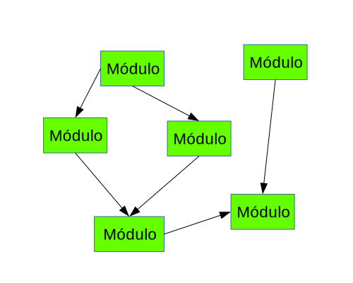

# O que é e como funciona?
O Wildfly introduziu uma nova forma de estruturar o Classloader, permitindo assim que as dependências entre as aplicações possam ser mais fáceis de gerenciar. 

A estrutura do ClassLoader modular do JBoss previne os problemas conhecidos como **JAR Hell**, assim permitindo que duas aplicações possam utilizar bibliotecas jar de diferentes versões.