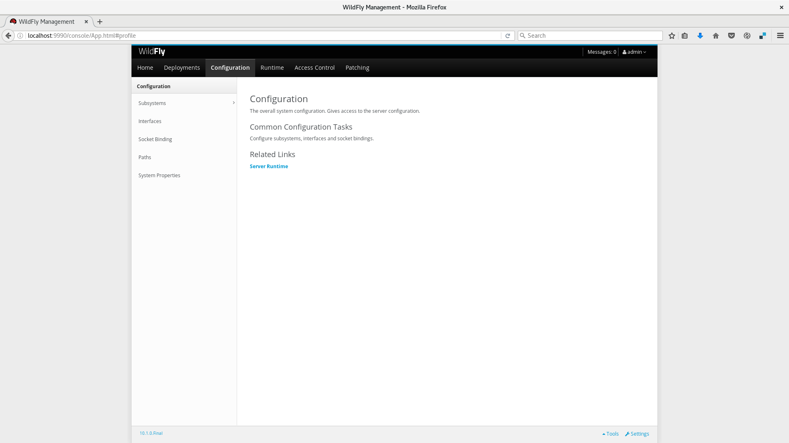
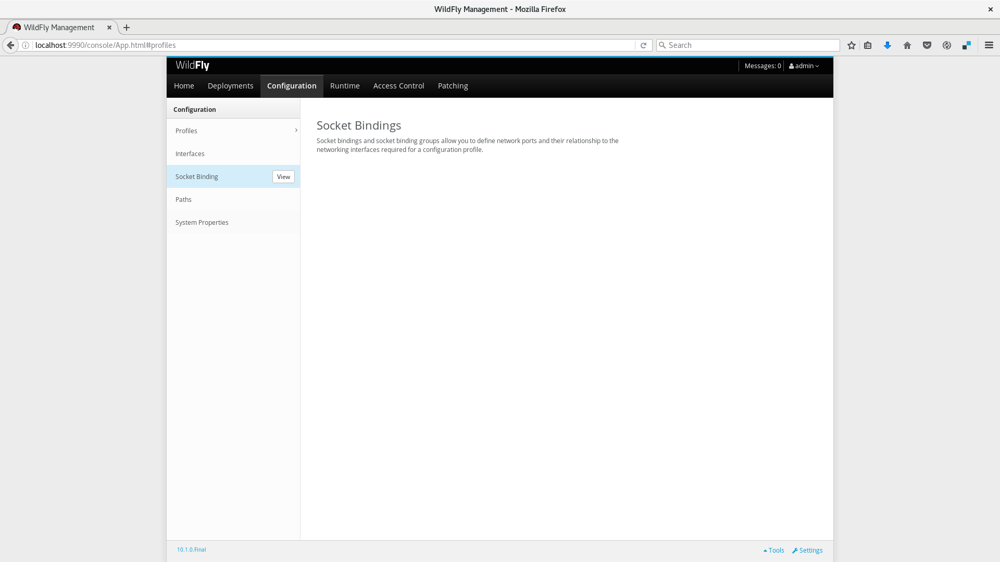
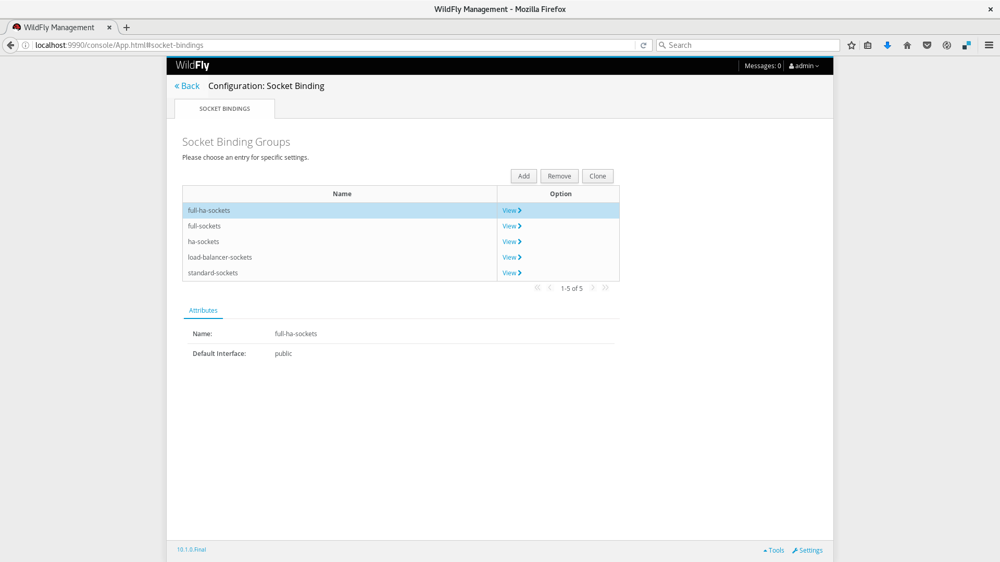
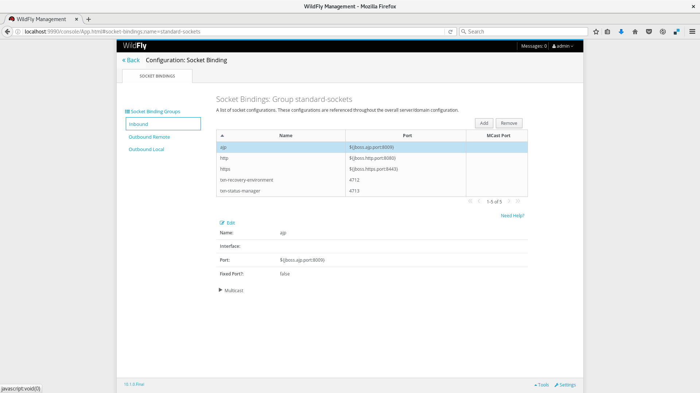

# Socket-bindings

_Socket Bindings_ define o conjunto de Sockets a serem utilizados pelos Subsystems do Wildfly. Nele, você pode definir um nome lógico para esse socket, a porta a ser utilizada, a qual Interface irá responder, se o tráfego é somente de saída, etc. Além disso, com a tag `<socket-binding-group>`, é possível definir um offset[^3] de portas para que instâncias diferentes rodando na mesma máquina física não tenham conflito de portas. Abaixo temos uma configuração de Socket Binding para o perfil Web:

```xml
    <socket-binding-group name="standard-sockets" default-interface="public" port-offset="${jboss.socket.binding.port-offset:0}">
        <socket-binding name="management-http" interface="management" port="${jboss.management.http.port:9990}"/>
        <socket-binding name="management-https" interface="management" port="${jboss.management.https.port:9993}"/>
        <socket-binding name="ajp" port="${jboss.ajp.port:8009}"/>
        <socket-binding name="http" port="${jboss.http.port:8080}"/>
        <socket-binding name="https" port="${jboss.https.port:8443}"/>
        <socket-binding name="txn-recovery-environment" port="4712"/>
        <socket-binding name="txn-status-manager" port="4713"/>
        <outbound-socket-binding name="mail-smtp">
            <remote-destination host="localhost" port="25"/>
        </outbound-socket-binding>
    </socket-binding-group>
```

## Como configurar

Além da configuração manual no XML, é possível também alterar os Socket-Bindings de outras maneiras a seguir:

### Via Web Console

* Acesse [http://localhost:9990](http://localhost:9990)


* Clique em `Configuration`



* Clique em `Socket Binding`



* Clique em `View`



* Aparecerá a listagem dos Socket Bindings disponíveis, onde é possível Adicionar/Remover/Editar os Socket Bindings



### Via CLI

```
/socket-binding-group=new-sockets:add(default-interface=public)
```

```
/socket-binding-group=new-sockets/socket-binding=new-socket-binding:write-attribute(name=interface,value=unsecure)
```

# Definindo Port Offset em modo Domain

```
/host=master/server-config=server-two/:write-attribute(name=socket-binding-port-offset,value=250)
```

## Interfaces

Interfaces são denominações lógicas para interfaces de rede que irão se associar aos sockets \(ver próxima seção\) para expor algum serviço de rede para os Subsystems. As Interfaces podem associar os sockets para um IP em específico ou até mesmo para uma NIC[^2] da máquina física, permitindo então dedicar o tráfego de rede dos Subsystems do Wildfly passar por uma interface específica de rede. Abaixo temos um exemplo de Interfaces:

```xml
    <interfaces>
        <interface name="public">
            <inet-address value="${jboss.bind.address:127.0.0.1}"/>
        </interface>
        <interface name="internal">
            <nic name="eth1"/>
        </interface>
    </interfaces>
```


