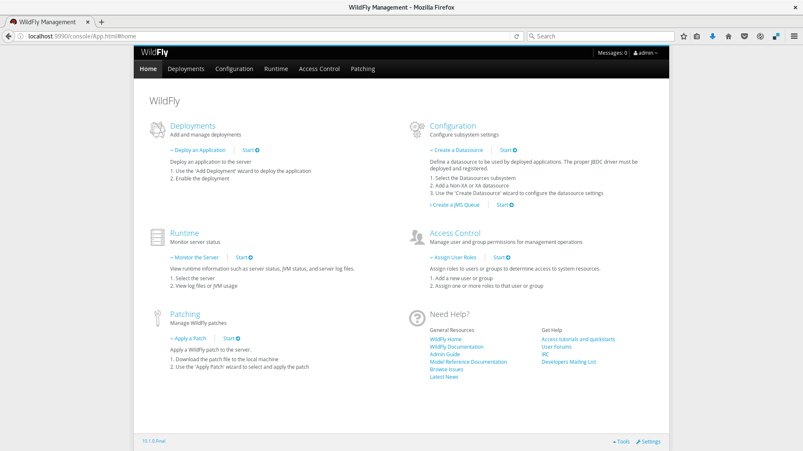
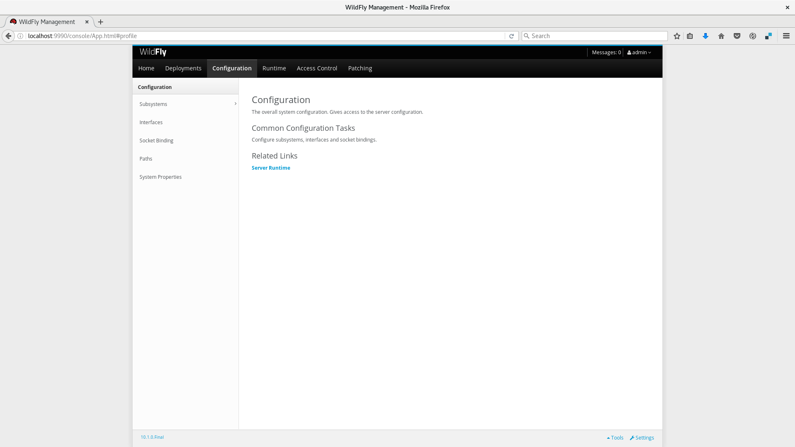
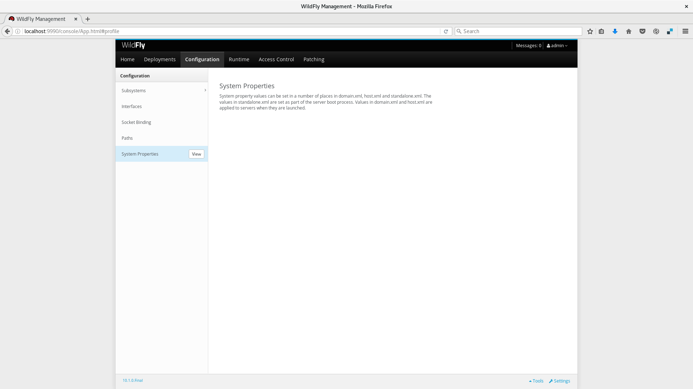
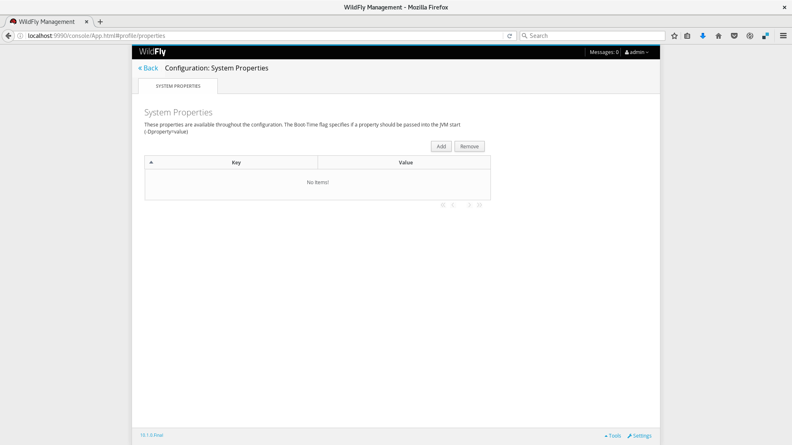
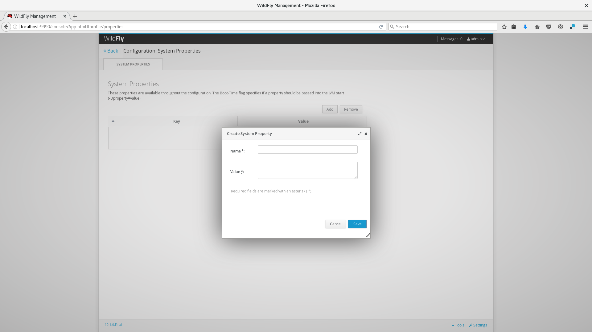

# System properties

Voltando rapidamente ao tópico [Interfaces](../configuracao/configurando_wildfly_10.html#interfaces), reparou em algo interessante na configuração? Vou copiar o trecho aqui para deixar mais claro:

```xml
...
<inet-address value="${jboss.bind.address:127.0.0.1}"/>
...
```

Perceba que o valor atribuido aqui foi escrito no formato de uma EL[^4], ou seja, é possível definir dinâmicamente um valor a ele ou apenas aceitar o valor padrão (que no caso desse exemplo é `127.0.0.1`). Essa funcionalidade permite que você utilize `placeholders` dentro dos arquivos de configuração permitindo que você defina esses valores ao inicializar o servidor sem precisar configurar os arquivos para cada instância.

Para inicializar uma instância de Wildfly alterando esse valor, basta que você execute o Wildfly dessa forma:

```bash
$ bin/standalone.sh -Djboss.bind.address=192.168.1.100
```

Esse comando irá iniciar uma instância de Wildfly com todos os seus serviços respondendo ao IP `192.168.1.100`. A opção `-D` da linha de comando é parte do java e é conhecido como _System Property_, onde qualquer aplicação Java pode receber valores dinâmicamente ao iniciar a JVM. O Wildfly fez uso dessa funcionalidade para tornar a configuração dos seus subsystems mais fáceis de alterar de instância para instância.

## Configurando System Properties usando JBoss Web Console

É Possível configurar também as System Properties via Web Console. Dessa forma, é possível configurar sem precisar alterar os parâmetros de inicialização. No entanto, ainda assim é necessário reiniciar o servidor.

Para Adicionar uma System Property, siga os passos abaixo:

* Acesse [http://localhost:9990](http://localhost:9990)



* Clique na aba `Configuration`



* Clique em `System Properties`



* Clique em `View`



* Clique em `Add`. Preencha com o nome da System Property e seu valor e depois clique em `Save`



## Configurando System Properties usando JBoss CLI

Também é possível utilizar o JBoss CLI para configurar as System Properties. Para isso, basta executar o script `jboss-cli.sh` e execute o seguinte comando:

```
/system-property=PROPERTY_NAME:add(value=PROPERTY_VALUE)
```

Exemplo:

```
/system-property=jboss.bind.address:add(value=192.168.1.2)
```

## Utilizando System Properties no modo Domain

System Properties é muito útil em ambientes utilizando o modo Domain, pois é possível configurar o escopo das System Properties das seguintes formas:

* Geral (Aplica a todos os servidores daquele ambiente)
* Server Group (Aplica aos servidores daquele Server Group específico)
* Server (Aplica-se em uma única instância)

No caso de haver uma System Property em mais de um escopo, prevalece aquele que é mais específico. Ou seja, havendo a mesma System Property Geral e no Server Group, prevalece a do Server Group, da mesma forma que se houver a mesma System Property no Server Group e no Server, prevalece a do Server.

[^4]: Expression Language