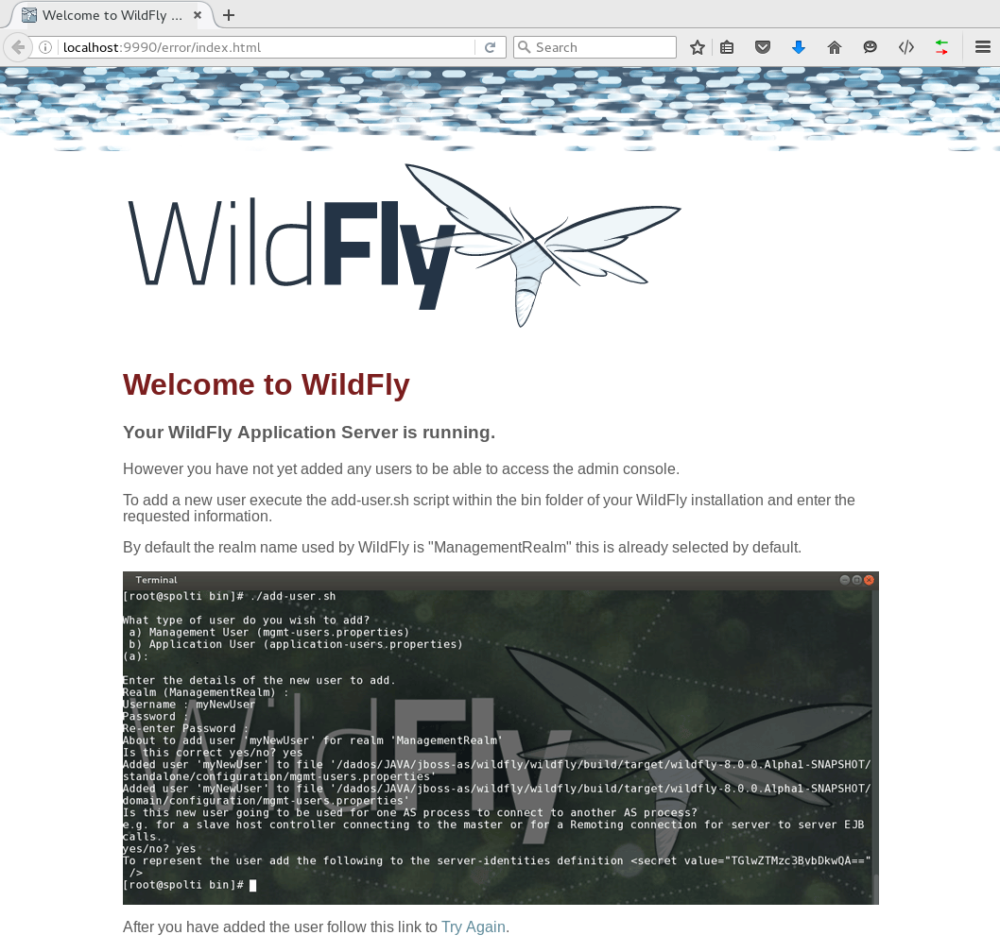

# Criando usuário de gerenciamento

  Para conseguirmos utilizar a console de gerenciamento do WildFly é necessário criar um usário de gerenciamento, também existe usuários de aplicação, segue uma pequena diferença entre eles:
  
  * Management: Usuários utilizados para gerenciar o WildFly utilizando os seguintes métodos:
    * Console de gerenciamento
    * JBoss CLI

Ambos estão disponíveis na porta **9990**.

Neste tópico iremos abordar somente a criação de usuário de gerenciamento bem como acessar a console de gerenciamento.

Caso você tente acessar a console de gerenciamento sem ter antes, criado o usuário você será redirecionado para a página abaixo informando que é necessário executar o script **add-user.sh|bat** para adicionar um usuário de gerenciamento utilizando o realm **ManagementRealm**:

* Acesse **http://localhost:9990**



Para adicionar o usuário siga os passos a seguir:

*  Execute o script **add-user.sh**
    ```
    $WFLY_HOME/bin/add-user.sh
    
    What type of user do you wish to add? 
     a) Management User (mgmt-users.properties) 
     b) Application User (application-users.properties)
    (a): 
    ```
Por padrão o **ManagementRealm** é selecionado, apenas aperte *enter* para prosseguir.
O próximo passo será definir o nome do usuário, escolha um username e prossiga:
```
Enter the details of the new user to add.
Using realm 'ManagementRealm' as discovered from the existing property files.
Username : admin  
```
Logo a seguir você será informado que o usuário **admin** já existe porém está desativado e irá lhe mostrar as opções disponíveis:
```
User 'admin' already exists and is disabled, would you like to... 
 a) Update the existing user password and roles 
 b) Enable the existing user 
 c) Type a new username
(a): 
```


