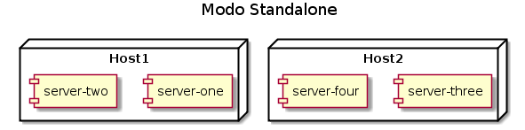
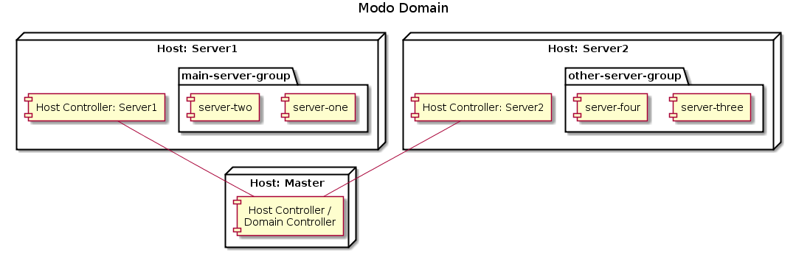

# Modo Standalone x Domain

O Wildfly tem dois modos de gerenciamento: _Standalone_ e _Domain_. Cada modo permite que você gerencie seus servidores de modo diferente utilizando topologias diferentes.

## Modo Standalone

O modo Standalone é o modo tradicional das versões anteriores. Basicamente implica em ter uma instalação diferente (ou um diretório _standalone_ diferente) para cada instância[^1] de Wildfly. Ou seja, para cada Wildfly rodando no seu ambiente é necessário alterar seus próprios arquivo de configuração, suas próprias opções de execução para JVM, etc.

## Modo Domain

O modo Domain é o modo que foi introduzido no JBoss AS 7 onde é possível gerenciar um conjunto de instâncias Wildfly, agrupando-os e assim permitindo compartilhar configurações comuns entre eles. Além de compartilhar configurações, é possível também através de um único console de gerenciamento iniciar ou parar instâncias (ou grupos inteiros), verificar seu status e estatísticas de cada subsystem (falaremos sobre isso mais adiante), etc.

## Qual o melhor modo de gerenciamento?

Obviamente, ao analisar os dois modos de gerenciamento, vem aquela famosa pergunta: "E agora? Qual deles é melhor?". Com certeza a resposta sempre partirá do "Depende", mas para dar uma ajuda em escolher o melhor modo de gerenciamento é necessário ter em mente as seguintea perguntas:

* O número de instâncias é muito pequeno (algo em torno de 10) ou muito grande?
* As máquinas físicas que irão rodar as instâncias estão no mesmo Datacenter ou espalhados geograficamente?
* Eu quero ter um gerenciamento das instâncias individual ou centralizada?
* Eu quero ter um controle mais rígido sobre o deployment das aplicações no ambiente?

Com base nessas perguntas, você consegue decidir com bastante clareza e segurança qual o melhor modo a ser utilizado.

> **IMPORTANTE:** os modos de gerenciamento em nenhum momento afetam Alta Disponibilidade, Performance ou alguma tecnologia Java EE. Eles apenas definem a melhor forma de gerenciamento das suas instâncias.

[^1]: Utilizamos o termo _instância_ para denominar um servidor Wildfly rodando isoladamente.