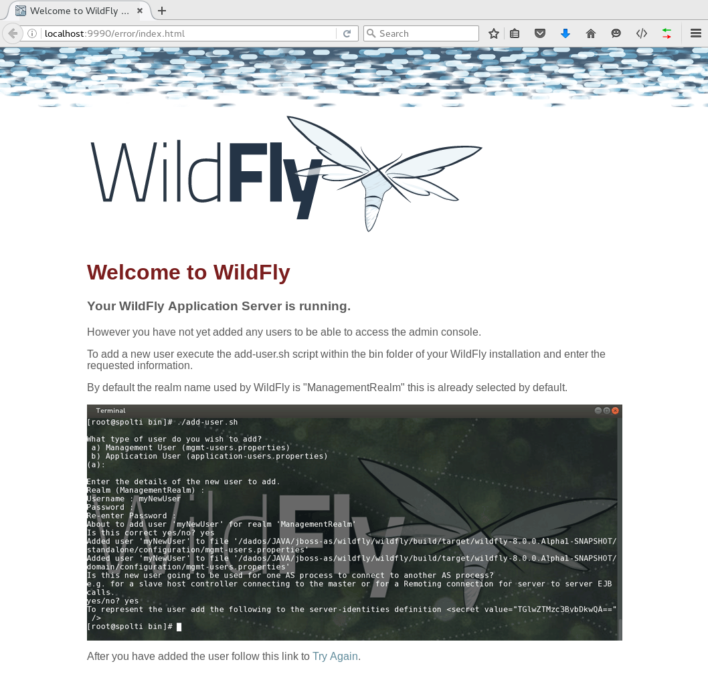
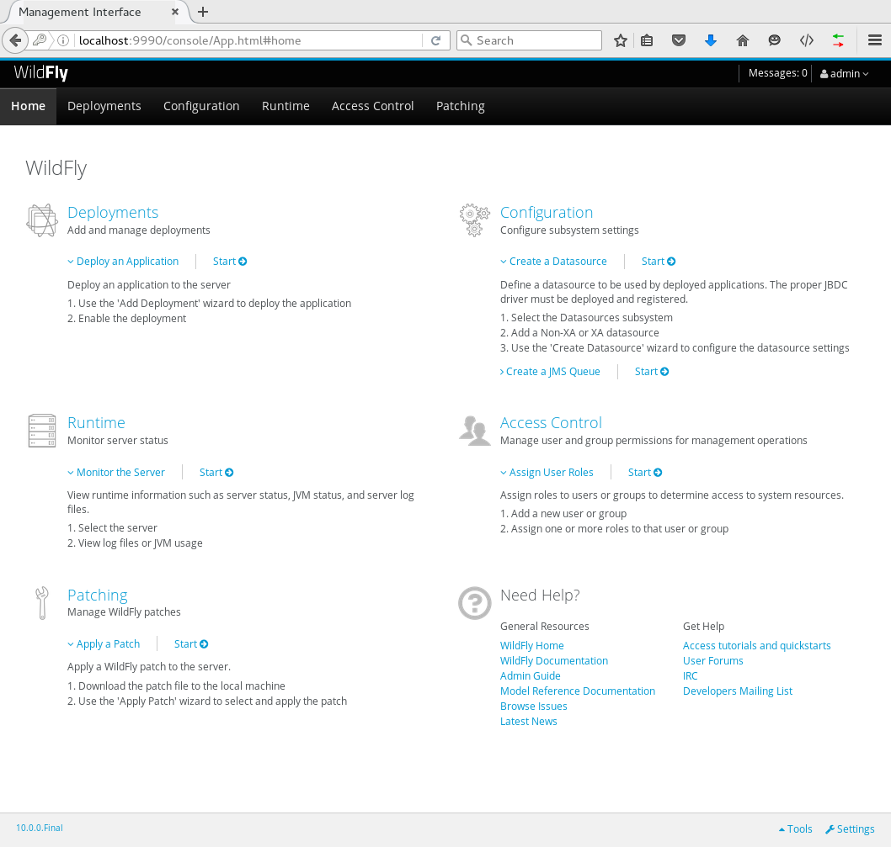

# Criando usuário de gerenciamento

Para conseguirmos utilizar a console de gerenciamento do WildFly é necessário criar um usário de gerenciamento, também existe usuários de aplicação, segue uma pequena diferença entre eles:

* Management: Usuários utilizados para gerenciar o WildFly utilizando os seguintes métodos:
  * Console de gerenciamento
  * JBoss CLI

Ambos estão disponíveis na porta _9990_.

Neste tópico iremos abordar somente a criação de usuário de gerenciamento bem como acessar a console de gerenciamento.

Caso você tente acessar a console de gerenciamento sem ter antes, criado o usuário você será redirecionado para a página abaixo informando que é necessário executar o script _add-user.sh_ \(_add-user.bat_ para Windows\) para adicionar um usuário de gerenciamento utilizando o realm _ManagementRealm_:

* Acesse [http://localhost:9990](http://localhost:9990)



Para adicionar o usuário siga os passos a seguir:

* Execute o script _add-user.sh_ que está localizado no diretório **$JBOSS\_HOME/bin**

```
$ ./add-user.sh

What type of user do you wish to add? 
 a) Management User (mgmt-users.properties) 
 b) Application User (application-users.properties)
(a):
```

Por padrão o _ManagementRealm_ é selecionado, apenas aperte _enter_ para prosseguir.

O próximo passo será definir o nome do usuário, escolha um username e prossiga:

```
Enter the details of the new user to add.
Using realm 'ManagementRealm' as discovered from the existing property files.
Username : admin
```

Logo a seguir você será informado que o usuário _admin_ já existe porém está desativado e irá lhe mostrar as opções disponíveis:

```
User 'admin' already exists and is disabled, would you like to... 
 a) Update the existing user password and roles 
 b) Enable the existing user 
 c) Type a new username
(a):
```

Você terá a opção de atualizar usuário existente e seus grupos, ativar o usuário existente ou digitar um novo username. Neste caso iremos somente atualizar a senha do usuário _admin_, por padrão esta opção já está selecionada, apenas tecle **enter**.

Agora defina a senha:

```
Password recommendations are listed below. To modify these restrictions edit the add-user.properties configuration file.
 - The password should be different from the username
 - The password should not be one of the following restricted values {root, admin, administrator}
 - The password should contain at least 8 characters, 1 alphabetic character(s), 1 digit(s), 1 non-alphanumeric symbol(s)
Password : 
Re-enter Password :
```

O próximo passo é definir os grupos, no momento não será necessário definir nenhum, apenas prossiga:

```
What groups do you want this user to belong to? (Please enter a comma separated list, or leave blank for none)[  ]: 
Updated user 'admin' to file '/opt/wildfly-10.1.0.Final/standalone/configuration/mgmt-users.properties'
Updated user 'admin' to file '/opt/wildfly-10.1.0.Final/domain/configuration/mgmt-users.properties'
Updated user 'admin' with groups  to file '/opt/wildfly-10.1.0.Final/standalone/configuration/mgmt-groups.properties'
Updated user 'admin' with groups  to file '/opt/wildfly-10.1.0.Final/domain/configuration/mgmt-groups.properties'
```

O script irá perguntá-lo se se este usuário será utilizado para autenticação entre 2 servidores WildFly \(Veremos com mais detalhes este processo na configuração do modo _Domain_\). Neste caso será um usuário normal, digite **no** e tecle **enter**

```
Is this new user going to be used for one AS process to connect to another AS process? 
e.g. for a slave host controller connecting to the master or for a Remoting connection for server to server EJB calls.
yes/no? no
```

Neste momento já estamos aptos a acessar a Console de Gerenciamento, tente acessá-la novamente e utilize as credenciais que criamos, caso esteja tudo certo você será redirecionado para a página principal:



### Dicas

#### Criando usuário somente com um comando:

```
$WFLY_HOME/bin/add-user.sh -u admin2 -p teste@123 -s -e
```

#### Criando usuários com senhas fracas \(não permitido através do script add-user\)

Este método não é recomendado, nunca use-o em produção.

```
echo -n "username:ManagementRealm:password" | openssl md5
 (stdin)= 8959126dd54df47f694cd762a51a1a6f
```

Com o **hash** em mãos edite o arquivo **$WFLY\_HOME/standalone/configuration/mgmt-users.properties** e adicione o novo usuário seguido do hash, exemplo:

```
username=8959126dd54df47f694cd762a51a1a6f
```

Caso deseje criar um _application_ user altere a Realm para _ApplicationRealm_.

#### Alterando a política de senhas

Também é possível alterar a política de senhas utilizada pelo script de criação de usuários. No diretório **$JBOSS\_HOME/bin **existe um arquivo chamado _add-user.properties_ com o seguinte conteúdo:

```bash
#
# Password restriction
#

# Valid values: RELAX, WARN or REJECT
# RELAX : Don't perform any strength checks on the password in both interactive and non-interactive mode
# WARN : Display a message about the strength of the password. Ask confirmation if the password is weak in interactive mode
# REJECT : Display a message about the strength of the password (if the password is weak, the user is not created).
# Ask confirmation if the password is weak in interactive mode
password.restriction=WARN

# Password minimum length
password.restriction.minLength=8

# Password must contains at least one alpha
password.restriction.minAlpha=1

# Password must contains at least one digit
password.restriction.minDigit=1

# Password must contains at least one symbol
password.restriction.minSymbol=1

# Password must not match the username. Valid values: TRUE or FALSE.
password.restriction.mustNotMatchUsername=TRUE

# Comma separated list of forbidden passwords (easily guessable)
password.restriction.forbiddenValue=root,admin,administrator

# Password strength. Valid values: VERY_WEAK, WEAK, MODERATE, MEDIUM, STRONG, VERY_STRONG or EXCEPTIONAL.
# If not present, it defaults to "MODERATE"
password.restriction.strength=MEDIUM

# Class of password strength checker.
# If not present, utility will revert to default implementation
password.restriction.checker=org.jboss.as.domain.management.security.password.simple.SimplePasswordStrengthChecker
```

Para alterar a política de senha conforme suas necessidades apenas edite a propriedade desejada neste arquivo e salve. As configurações realizadas já serão aplicadas na criação do próximo usuário.

