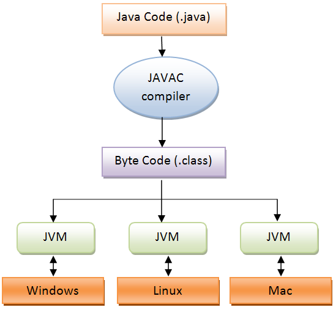

# Introdução

Java é o nome dado tanto à linguagem de programação largamente conhecida quanto à plataforma por trás da linguagem. Sua popularidade se deve ao fato de que a linguagem é compilada em um código intermediário \(conhecida como Bytecode\) para execução dentro da Máquina Virtual Java \(ou JVM\). Isso proporcionou ao Java uma série de facilidades na programação que permite ao desenvolvedor se preocupar somente em programar o que realmente é necessário para a programação, deixando questões como coleta de lixo \(Garbage Collection\), performance de execução de código nativo, gerenciamento de memória e outros para a Máquina Virtual Java. Tal característica hoje é utilizada em outras linguagens de programação, como .NET e Python, tamanha a importância da Máquina Virtual nos paradigmas atuais de linguagens de programação.

Isso proporcionou à Máquina Virtual Java não somente executar programas escritas na linguagem Java como também outras linguagens. Atualmente, é possível executar programas escritos em Groovy, Scala, Python, Ruby e outros na Máquina Virtual Java por conta dessas linguagens disponibilizarem compiladores especiais que permitem criar o Bytecode para executar na JVM.

A plataforma Java, desde a sua concepção, recebeu algumas divisões com o objetivo de tornar a evolução da plataforma focado em seus devidos objetivos, dentre eles podemos citar:

* _Java Standard Edition \(ou Java SE\)_: É o nome dado à plataforma nas sua mais básica utilização, cobrindo toda a implementação da Linguagem Java, do Bytecode e da JVM.
* _Java Enterprise Edition \(ou Java EE\)_: É o nome dado à plataforma com foco em aplicações corporativas \(objetivo desde livro\), cobrindo características como persistência de dados, distributabilidade, segurança e outros assuntos pertinentes. Desde a versão 1.6 do Java EE a plataforma se dividiu em dois perfis (profiles):
  _web_: Onde tudo o que será utilizado/disponibilidado por um fornecedor serão características que permitem o desenvolvimento de uma aplicação Web
  _full_: Onde o que será utilizado/disponibilizado pelo fornecedor serão todo o perfil Web mais características adicionais que permitem o uso de componentes como EJB e outros
* _Java Micro Edition \(ou Java ME\)_: É o nome dado à plataforma cujo objetivo é o foco em dispositivos embarcados \(Smartphones, Impressoras, Set-top boxes, Microcontroladores em geral e outros\). Essa plataforma em específico é dividida dois perfis, sendo eles:
  * _Connected Limited Device Configuration \(ou CLDC\)_: Um perfil com foco em dispositivos que possuem conexão limitada ou nenhuma conexão com a Internet
  * _Connected Device Configuration \(ou CDC\)_: Um perfil com foco em dispositivos que possuem conexão com Internet
* _Java Card_: Uma plataforma muito específica com foco no desenvolvimento de aplicações que utilizam Smart Cards
* _Java TV_: Uma plataforma com foco para TV Digital (O Ginga, plataforma brasileira para TV Digital, utiliza partes dessa plataforma)

Há outras plataformas criadas para outros fins, mas não iremos extender em descrever todas. Conforme já mencionado, o objetivo deste livro está no foco ao Java EE, onde o Wildfly implementa suas características.

## Como assim o Wildfly implementa o Java EE?

As plataformas principais do Java (Java SE, Java EE e Java ME) são regidas por um conselho formado pela Oracle (hoje "proprietária" do Java, antes era da Sun), empresas, Java User Groups (ou JUGs) e indivíduos que definem as próximas tecnologias a serem desenvolvidas para as próximas versões de suas plataformas, conhecido como Java Community Process (ou JCP). Nela, é possível discutir com todos os envolvidos na comunidade Java (ela é livre para quem quiser contribuir) quais serão as novas tecnologias a serem adicionadas nas próximas versões de suas plataformas. Todo o processo de adicionar ou até mesmo melhorar um determinado componente ou tecnologia da Plataforma Java é feita por um processo formal chamado de Java Specification Request (ou JSR), onde é atribuído a ela um _Expert Group_ que trabalha para discutir a especificação daquele componente ou tecnologia.

Sendo assim, a JCP define como determinada plataforma deve ser construída, ficando a cargo das empresas interessadas em ter um software alinhado àquela plataforma literalmente implementar aquelas especificações. Hoje, empresas como Oracle, Red Hat e IBM são as principais que trabalham para implementar essas especificações em suas soluções.

O Wildfly, então, é uma implementação da plataforma Java EE. Isso significa que todas as especificações determinadas para uma determinada versão do Java EE (a versão mais recente é a Java EE 1.7) foram implementadas no Wildfly.

## Mas afinal de contas o que é Java EE?

Java EE é o conjunto de JSRs que focam no desenvolvimento de aplicações corporativas cujo foco está nas seguintes características:

* Distributabilidade
* Persistência
* Segurança
* Gerenciamento de Transações
* Mensageria
* Entre outros...

É importante lembrar que o objetivo da especificação Java EE (sim, Java EE também é uma especificação, conhecida como _Umbrella Specification_) é padronizar o uso de determinadas tecnologias e portanto ela não tem como objetivo criar inovações tecnológicas em torno da plataforma. Seu objetivo principal é evitar o fenômeno chamado de _Vendor Lock-In_, que é um fornecedor "prender" seus clientes a uma característica muito específica e que altera uma funcionalidade do Java EE. Claro que há outros aspectos que o Java EE não pretende controlar, como por exemplo _Clustering_, sendo esse livre para o fornecedor criar sua própria implementação. A este caso específico foi dada essa liberdade de implementação para permitir a livre concorrência entre seus fornecedores e atraí-os para a comunidade Java.

## O que virá nos próximos capítulos?

O livro irá trazer uma breve introdução ao Wildfly, sua arquitetura e depois mostraremos algumas das tarefas administrativas que podem ser feitas para configurar os componentes do Java EE, bem como fazer o _deployment_ de aplicações Java EE dentro do Wildfly.